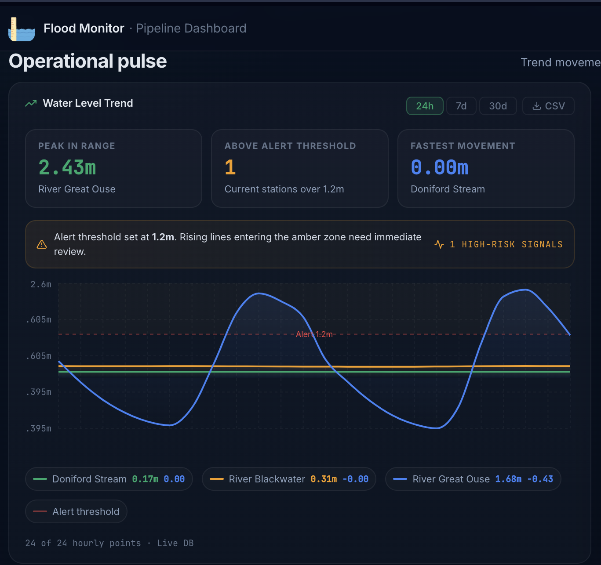
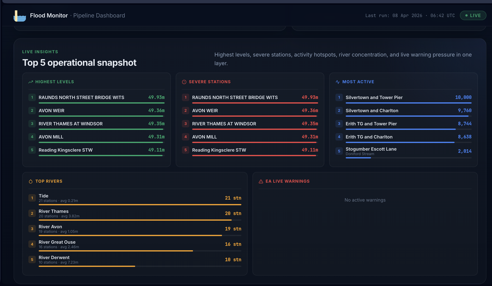
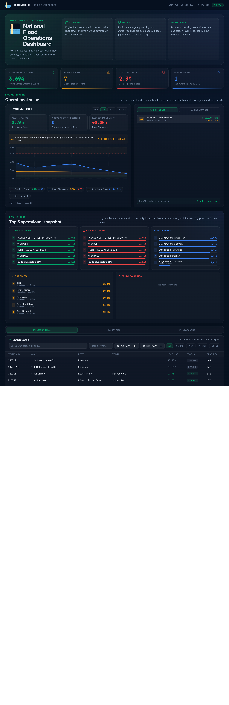
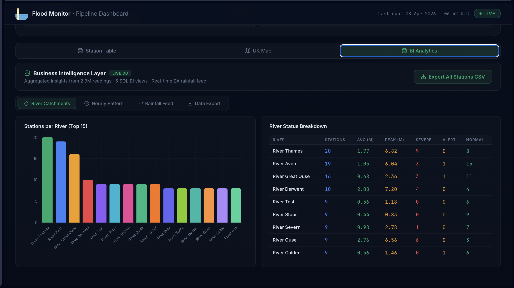
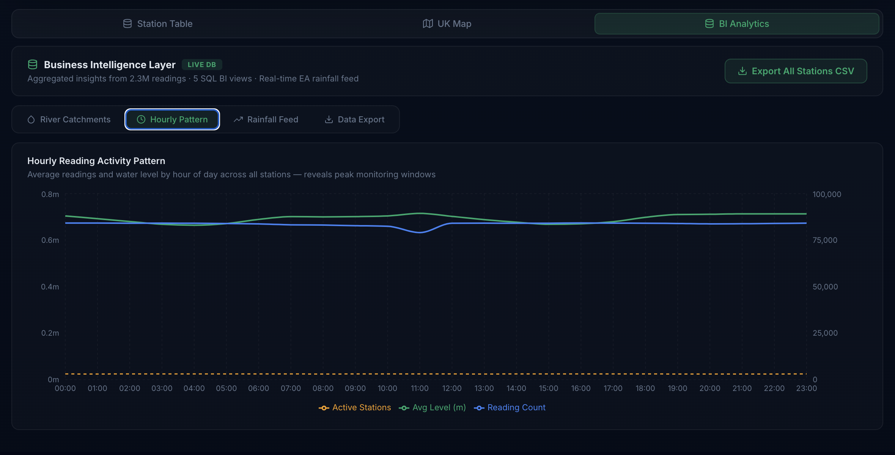
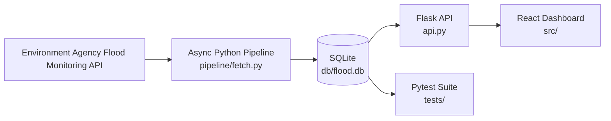
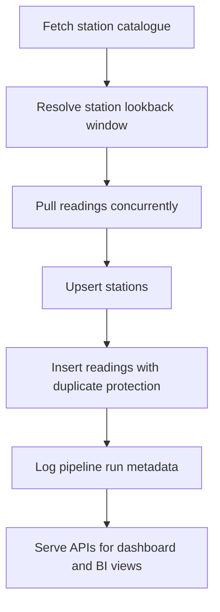

# Flood Monitor

Real-time flood monitoring pipeline and dashboard built on Environment Agency data.

This project ingests station readings into SQLite, serves analytical and operational APIs through Flask, and exposes the data in a React dashboard with station search, trend charts, BI views, rainfall snapshots, and map exploration.

## Overview

- Async Python pipeline ingests Environment Agency station readings
- SQLite stores stations, readings, pipeline audit logs, and daily aggregates
- Flask exposes operational, BI, export, warning, and chart endpoints
- React dashboard visualizes live monitoring, trends, map data, and BI analytics

## Screenshots

### Dashboard Overview


### Water Level Trend



### Top 5 Operational Snapshot



<<<<<<< HEAD
<<<<<<< HEAD

=======

>>>>>>> 2460d96 (feat: ReadME update)
=======
### BI River Catchments
>>>>>>> f30987d (feat: ReadME update2)



### BI Hourly Pattern



## Architecture



## Data Flow



## Current Dataset Snapshot

These values reflect the database currently present in this repository.

| Metric | Value |
|---|---:|
| Stations | 3,694 |
| Readings | 2,308,750 |
| Pipeline runs logged | 1 |
| Distinct reading dates loaded | 8 |
| API routes exposed | 11 |

## Features

### Operational dashboard

- Water level trend view for `24h`, `7d`, and `30d`
- Top 5 operational snapshot across highest levels, severe stations, most active stations, river concentration, and warnings
- Pipeline audit log view
- Live flood warning integration

### Station exploration

- Paginated station table
- Search by label, river, or station id
- Expandable station readings
- UK map view with station markers
- CSV export

### BI layer

- River catchment summary
- Hour-of-day activity pattern
- Live rainfall snapshot from the EA API
- Station export endpoint for downstream analysis

## Stack

| Layer | Technology |
|---|---|
| Ingestion | Python, `asyncio`, `aiohttp` |
| Storage | SQLite with WAL mode |
| API | Flask, Flask-CORS |
| Frontend | React, Recharts, Leaflet, React Icons |
| Testing | Pytest |

## Project Structure

```text
flood-monitoring/
├── api.py
├── assets/
│   ├── dashboard.png
│   ├── HourlyPattern.png
│   ├── RiverCatchments.png
│   ├── top5.png
│   └── WaterLevelTrend.png
├── db/
│   └── flood.db
├── pipeline/
│   ├── __init__.py
│   └── fetch.py
├── public/
├── src/
│   ├── App.js
│   └── components/
├── tests/
│   └── test_pipeline.py
├── package.json
├── requirements.txt
└── README.md
```

## Database Model

The pipeline creates:

- `stations` for metadata and incremental fetch state
- `readings` for time-series measurements
- `pipeline_runs` for audit history
- `v_daily_max` for daily rollups

## API Reference

### Operational endpoints

| Endpoint | Purpose |
|---|---|
| `/api/stats` | KPI totals for stations, readings, alerts, and runs |
| `/api/stations` | Paginated station catalogue |
| `/api/stations/<station_id>/readings` | Recent readings for a station |
| `/api/chart/top-stations` | Trend data for top stations by range |
| `/api/top5` | Operational summary cards |
| `/api/warnings` | Live EA warning data |
| `/api/pipeline/runs` | Pipeline audit log |

### BI and export endpoints

| Endpoint | Purpose |
|---|---|
| `/api/bi/catchment-summary` | Catchment aggregates by river |
| `/api/bi/hourly-pattern` | Hour-of-day activity summary |
| `/api/rainfall` | Latest rainfall snapshot from EA |
| `/api/export/stations` | Station export CSV |

## Quick Start

### 1. Clone

```bash
git clone https://github.com/mathewkadesh/flood-monitoring.git
cd flood-monitoring
```

### 2. Create and activate the Python environment

```bash
python3 -m venv venv
source venv/bin/activate
pip install -r requirements.txt
```

### 3. Build or refresh the database

```bash
# Full backfill
python3 pipeline/fetch.py --full

# Incremental refresh
python3 pipeline/fetch.py
```

### 4. Start the API

```bash
python3 api.py
```

Flask runs on `http://127.0.0.1:5000`.

### 5. Start the frontend

```bash
npm install
npm start
```

React runs on `http://localhost:3000`.

## Example Requests

```bash
curl http://127.0.0.1:5000/api/stats
curl "http://127.0.0.1:5000/api/stations?search=thames&page=1&limit=10"
curl "http://127.0.0.1:5000/api/chart/top-stations?range=24h"
curl http://127.0.0.1:5000/api/bi/catchment-summary
curl http://127.0.0.1:5000/api/rainfall
```

## Tests

Run the backend tests with:

```bash
source venv/bin/activate
pytest tests -v
```

The suite covers database initialization, URL generation, deduplication, data quality checks, pipeline run logging, and daily aggregate view behavior.

## Notes

<<<<<<< HEAD
## ☁️ Cloud Deployment Plan

For production deployment on AWS:
Pipeline (ECS Fargate) ──── EventBridge (every 15 min)
│
▼
PostgreSQL RDS ──── Read Replica (analysts/scientists)
│
▼
Flask API (ECS Fargate + ALB)
│
▼
React Dashboard (S3 + CloudFront)

Migration from SQLite to PostgreSQL requires only:
1. Change connection string
2. Replace `INSERT OR IGNORE` with `INSERT ... ON CONFLICT DO NOTHING`
3. Add TimescaleDB extension for time-series optimisation

---

## 📁 Project Structure
flood-monitoring/
├── pipeline/
│   ├── init.py
│   └── fetch.py          # async pipeline — main entry point
├── db/                   # gitignored — generated by pipeline
│   └── flood.db
├── src/
│   ├── components/
│   │   ├── StatsRow.js
│   │   ├── WaterLevelChart.js
│   │   ├── PipelineLog.js
│   │   ├── StationTable.js
│   │   ├── MapView.js
│   │   └── Top5Panel.js
│   ├── App.js
│   └── App.css
├── tests/
│   └── test_pipeline.py
├── docs/
│   └── ANSWERS.md        # full answers to all 6 questions
├── api.py                # Flask REST API
├── requirements.txt
├── .gitignore
└── README.md

---

## 🙏 Data Attribution

> This project uses Environment Agency flood and river level data  
> from the real-time data API (Beta).  
> Licensed under the Open Government Licence v3.0.

---

<<<<<<< HEAD
*Built by Mathew Kadesh · April 2026*
=======
*Built by Mathew Kadesh · April 2026*
>>>>>>> 2460d96 (feat: ReadME update)
=======
- The dashboard range views are anchored to the latest timestamp in the database, not the local machine clock.
- The `30d` chart can legitimately show fewer than 30 days if the database contains less history.
- Rainfall is sourced from the latest EA rainfall snapshot, so the UI presents it as a ranked current view rather than a synthetic time series.
>>>>>>> f30987d (feat: ReadME update2)
