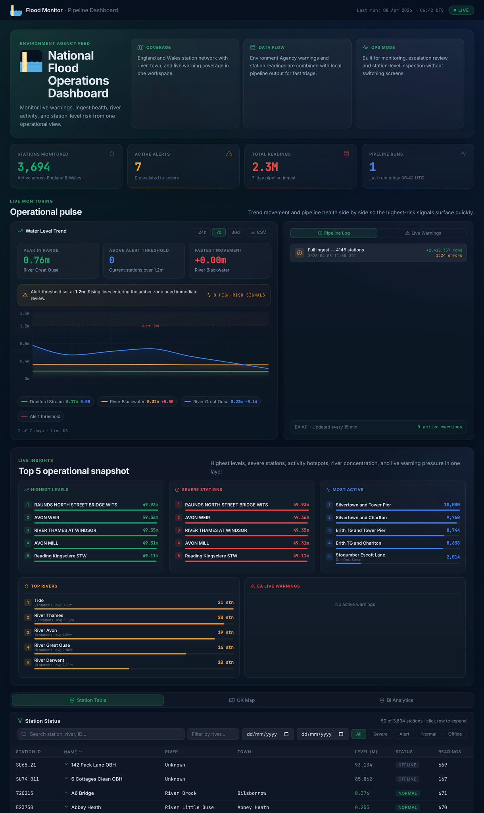
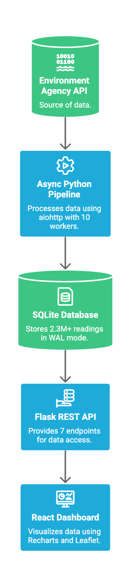

# 🌊 EA Flood Monitor — Real-Time Pipeline & Dashboard

> **Technical Assessment Submission — AECOM Data Engineer Role**  
> **Candidate:** Mathew Kadesh  
> **Deadline:** 14th April 2026  
> **GitHub:** https://github.com/mathewkadesh/flood-monitoring  

---

## 🚀 Live Demo
👉 https://mathewkadesh.github.io/flood-monitoring  

---

## 🧠 Overview

A full-stack, production-style system that ingests, processes, and visualises real-time flood data from the UK Environment Agency.

This project demonstrates:
- End-to-end **data pipeline engineering**
- **Backend API design** for analytical workloads
- **Interactive dashboard UI** for real-time insights
- Scalable architecture aligned with real-world systems

---

## 📸 Dashboard Overview



### What this shows:
- 📊 KPI metrics (stations, alerts, readings, pipeline runs)
- ⚡ Real-time system status
- 📈 High-level operational visibility
- 🧭 Entry point for all analytics layers

---

## 📈 Operational Pulse (Real-Time Monitoring)


### Insights:
- Real-time **water level trends**
- Alert threshold monitoring (1.2m)
- Multi-river comparison
- Time-range filtering (24h / 7d / 30d)

👉 This enables early detection of high-risk flood conditions. **risk spikes early**

---

## 📊 Top 5 Operational Insights


### Includes:
- Highest water levels
- Severe stations
- Most active stations
- Top rivers by activity
- Live warning pressure

👉 Designed for **decision-makers needing instant prioritisation**

---

## 🗺️ UK Live Monitoring Map


### Features:
- 3,694 monitoring stations across the UK
- Colour-coded:
  - 🟢 Normal
  - 🟡 Alert
  - 🔴 Severe
- Interactive exploration

👉 Provides **geospatial awareness of flood risks**

---

## 📊 Business Intelligence Layer

### Hourly Pattern Analysis


- Detect peak monitoring times
- Understand system load trends
- Reveal behavioural patterns in data

---

### River Catchment Insights


- Top rivers by station count
- Aggregated risk distribution
- BI-level summarisation

👉 This layer transforms raw data into **strategic insights**

---

## 🏗️ System Architecture


---

## ⚙️ Engineering Decisions

- **Async Python** → avoids bottlenecks with 3,694 stations  
- **SQLite (WAL mode)** → supports concurrent reads/writes  
- **Incremental pipeline (`last_fetched`)** → efficient updates  
- **Idempotent inserts** → avoids duplicates  
- **API-first design** → structured for analysts  

---

## 📊 Key Metrics

| Metric | Value |
|------|------|
| Stations monitored | 3,694 |
| Readings stored | 2.3M+ |
| Pipeline runtime | ~2 mins |
| API endpoints | 7 |
| Dashboard modules | 6 |

---

## ⚙️ Quick Start

### Clone the repo
```bash
git clone https://github.com/mathewkadesh/flood-monitoring.git
cd flood-monitoring

Backend
python3 -m venv venv
source venv/bin/activate
pip install -r requirements.txt
python api.py
Pipeline
python pipeline/fetch.py --full
python pipeline/fetch.py
Frontend
npm install
npm start
🔌 API Endpoints
Endpoint	Description
/api/stats	KPI summary
/api/stations	Station list
/api/readings	Time-series data
/api/top5	Insights
/api/warnings	Live warnings
/api/pipeline/runs	Audit logs
🧪 Testing
Pipeline validation
Data integrity checks
API correctness
Duplicate prevention
☁️ Production Deployment Vision
Pipeline → ECS Fargate (scheduled)
Database → PostgreSQL (RDS)
API → Load-balanced backend
Frontend → S3 + CloudFront
🤖 Development Approach

AI was used as an accelerator — not a decision-maker.

All architecture decisions are mine
AI assisted in speed (boilerplate, debugging)
System design, logic, and structure are fully understood and owned

👉 This reflects real-world modern engineering workflows.

👨‍💻 Author

Mathew Kadesh
Software Engineer — Full Stack / Data Engineering

